# Quorum Maker V2.2

Synechron's Quorum Maker is a tool that allows users to spin up nodes in a Quorum network. Manually editing configuration files and creating nodes is a slow and error-prone process. Quorum Maker can create any number of nodes of various configurations dynamically with reduced user input. This provides a wizard-like interface with a series of questions to guide the user when creating nodes. Quorum Maker can create nodes to:

-	run with docker-compose (Raft consensus/Quorum 2.0.2) for easy use in development environments; or,
-	nodes to be distributed on separate Linux boxes or cloud instances for a production environment (Raft consensus/Quorum 2.0.2)

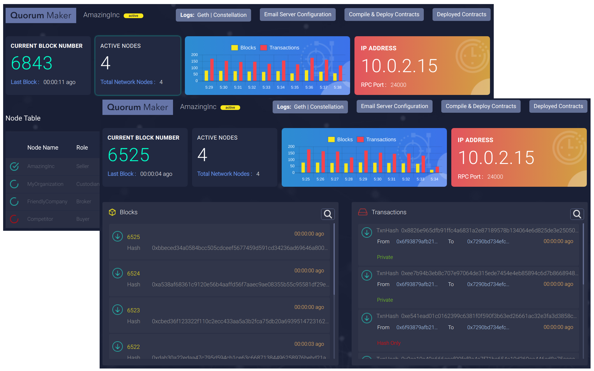 
## Quorum Maker provides the following benefits:
  -	An easy interface to create and manage the Quorum Network
  -	A modern UI to monitor and manage Quorum Network
  -	A Network Map Service to be used for identifying nodes and self-publishing roles.  
  -	Block and Transaction Explorer
  -	Smart Contract Deployment
  -	Email Notifications
## Features at a glance

Quorum Maker v2.2 is an upgrade on v1.0 released by Synechron in October 2017. This upgrade, and future expected upgrades, aim to support application developers in the pursuit of production readiness for the growing number of applications built on top of the Quorum platform. 

| Features | V 1.0 | V 2.2 |
| ------ | ------ |-----|
| Create Network |  |  |
|Join Network |   | |
|Attach to existing Quorum Node	 	  |  |  |
|Quick Setup with Docker	 	  |  |  |
|Quick network with Docker Compose	 	  |  |  |
|Quorum Chain Consensus	 	  |  |  |
|Raft Consensus	 	  |  |  |
|Istanbul PBFT Consensus	 	  |  |  |
|Network Map Service  	 	  |  |  |
|Node Monitoring	 	  |  |  |
|Web UI	 	  |  |  |
|Block Explorer	 	  |  |  |
|Transaction Explorer	 	  |  |  |
|Smart Contract Deployer	 	  |  |  |
|Smart Contract Explorer	 	  |  |  |
|Transaction Parameters View	 	  |  |  |
|Email Notification	 	  |  |  |
|Online Logs View	 	  |  |  |
|Restful API	 	  |  |  |


## Contents
1. [Quickstart](#quickstart)
1. [Setting up Quorum Test/Development Network](#setting-up-quorum-testdevelopment-network)
   * [Setting up nodes](#setting-up-nodes)
   * [Running Test/Development Network](#running-testdevelopment-network)
1. [Setting up Quorum Network on multiple machines](#setting-up-quorum-network-on-multiple-machines)
   * [Creating the first node](#creating-the-first-node)
   * [Joining a Network](#joining-a-network)
   * [Approve/Reject Join Request](#approvereject-join-request)
1. [Attaching Quorum Maker to existing Quorum node](#attaching-quorum-maker-to-existing-quorum-node)
1. [Quorum Maker Web UI](#quorum-maker-web-ui)
   * [Node Explorer](#node-explorer)
   * [Blockchain Explorer](#blockchain-explorer)
   * [Transaction Parameters View](#transaction-parameters-view)
   * [Contract Deployment](#contract-deployment)
   * [Contract Explorer](#contract-explorer)
   * [Log Viewer](#log-viewer)    
   * [Monitoring and Email Notification](#monitoring-and-email-notification)
1. [Quorum Maker Node Manager API](#quorum-maker-node-manager-api)
1. [Windows/Mac Support](#windowsmac-support)
   * [Using Docker](#using-docker)
   * [Using Vagrant](#using-vagrant)
1. [Mobile Device Support](#mobile-device-support)
1. [Using a different version of Geth/Constellation](#using-a-different-version-of-gethconstellation)
1. [Work In Progress](#work-in-progress)
1. [Troubleshooting](#troubleshooting)


## Quickstart

The first step to use Quorum Maker is to clone the source code from GitHub. 

```
$ git clone git@github.com:synechron-finlabs/quorum-maker.git 
```

Once the repository is successfully cloned, change to the Quorum Maker directory by `$ cd quorum-maker` and run `$ ./setup.sh` script. To minimize the pre-requisites and make setup easy, Quorum Maker uses docker and rest of the dependencies are baked to `syneblock/quorum-maker` image.

## Setting up Quorum Test/Development Network

Quorum Maker allows to quickly spin up a Quorum network for development or test purpose using Docker Compose with minimal input. Nodes created would be fully functional with all the features of Quorum as well as Quorum Maker. This allows developers to experiment with latest features with different number of nodes. 

### Setting up nodes

Once the repository is successfully cloned, change to the Quorum Maker directory by `$ cd quorum-maker` and run `$ ./setup.sh` script. Choose the option `4` to Setup Development/Test Network. This will ask you to provide a project name and number of nodes to be created. You can either leave to the default values or enter your choice. 

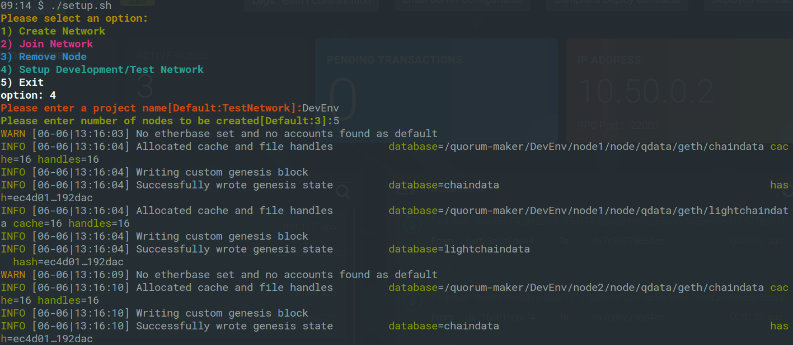 

A series of commands will be executed and you can see that a new directory with the name of the project your entered get created. This directory contains a `docker-compose.yml` and as many directories as the number of nodes you asked to create. 

## Running Test/Development Network

After the project is created, change to the directory just created and run `$ docker-compose up` to bring up the network. You will see each node coming up and node managers for each node getting started. Once the activities stop, you will have a fully functioning Quorum Network running. 

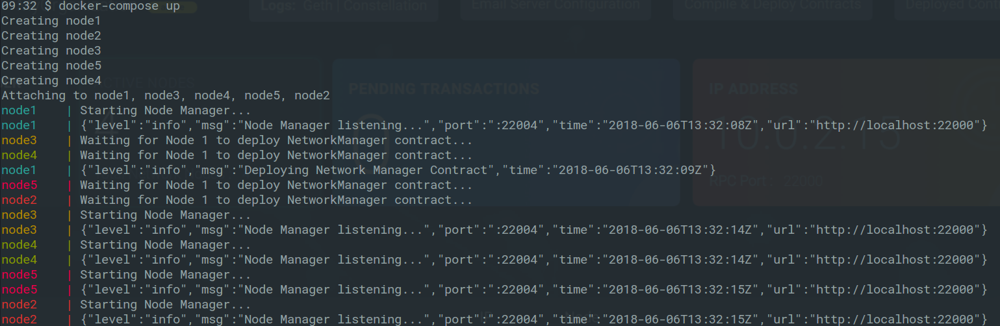 

> Note:
By default Quorum Maker creates bridge network with `subnet: 10.50.0.0/16` and `gateway: 10.50.0.1`. If you would like to run multiple Quorum Network on same machine, change this setting on the generated `docker-compose`.

Each node created gets it own IP address starting with `10.50.0.2`. Following are the standard ports used by Quorum Maker.

`RPC Port : 22000`  
`Whisper Port : 22001`  
`Constellation Port : 22002`  
`RPC Port : 22003`  
`Quorum Maker Node Manager Port : 22004`

You can now connect to the Quorum Maker UI for each node from a web browser by pointing to `http://10.50.0.2:22004`, `http://10.50.0.3:22004` etc. 

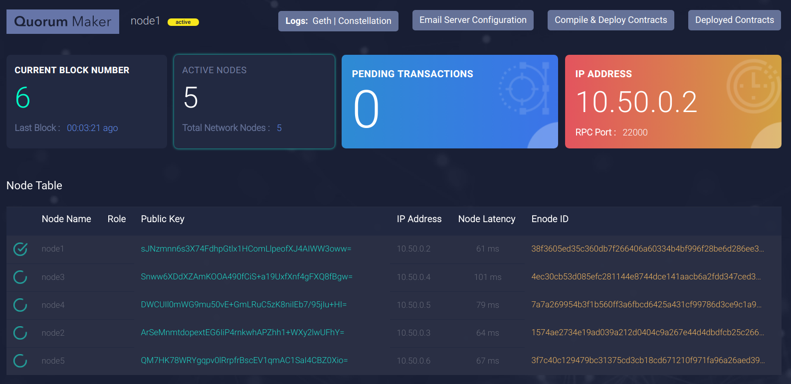 

> Note: By default, Quourm Maker doesnt expose ports to the host due to possible conflicts, when running Development/Test Network. You can update `docker-compose.yml` to expose any port you would like to be accessible outside your computer. 

## Setting up Quorum Network on multiple machines

Quourm Maker supports creating nodes on multiple machines and form a fully decentralized Quorum network. Each node administrators can clone Quorum Maker and run the same `setup.sh` script create a new network or join an existing one. 

### Creating the first node

Once the repository is successfully cloned, change to the Qorum Maker directory by `$ cd quorum-maker` and run `$ ./setup.sh` script.

After the required docker images are downloaded, Quorum Maker will present with few questions to complete the node setup. 

`Please select an option:`  
`1) Create Network`  
`2) Join Network`  
`3) Attach to an existing Node`  
`4) Setup Development/Test Network`  
`5) Exit`

`option:` 1  
`Please enter node name:` Org1  
`Please enter IP Address of this node:` 10.0.2.15  
`Please enter RPC Port of this node[Default:22000]:`  
`Please enter Network Listening Port of this node[Default:22001]:`  
`Please enter Constellation Port of this node[Default:22002]:`  
`Please enter Raft Port of this node[Default:22003]:`  
`Please enter Node Manager Port of this node[Default:22004]:`

This completes the creator node startup procedure. Quorum Maker collects the user provided parameters in order to generate geth and constellation inside the docker container. It also starts the NodeManager service.  and creates a directory with the node name provided. This directory has the script to start the node and other files required. You can stop the node any time using `Ctrl + C`, and restart by running `./start.sh` from the node directory (Eg. `Org1`). 

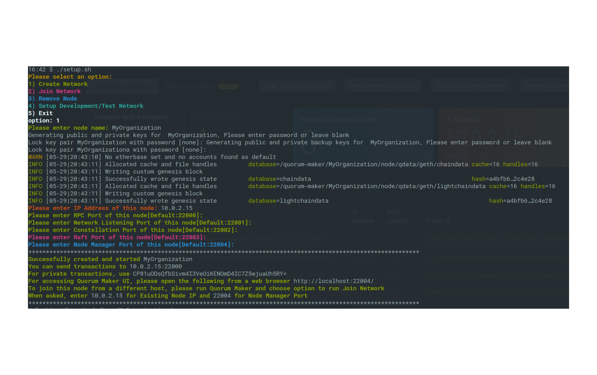 

### Joining a Network
Once a node is created, you can create and join more nodes to form a Quorum Network. Ideally subsequent nodes should be created on other computers. If you are creating another node on the same computer, please make sure to use different ports. In this case you can use the same Quorum Maker clone, since it creates separate directories for each node.


```
$ cd quorum-maker
$ ./setup.sh
```

After the required docker images are downloaded, Quorum Maker will present users with a few questions to complete the node setup.

`Please select an option:`  
`1) Create Network`  
`2) Join Network`  
`3) Attach to an existing Node`  
`4) Setup Development/Test Network`  
`5) Exit`

`option:` 2  
`Please enter node name:` Org2  
`Please enter IP Address of existing node:` 10.0.2.15  
`Please enter Node Manager Port of existing node:` 22004  
`Please enter IP Address of this node:` 14.0.2.30  
`Please enter RPC Port of this node[Default:22000]:`24000  
`Please enter Network Listening Port of this node[Default:24001]:`  
`Please enter Constellation Port of this node[Default:24002]:`  
`Please enter Raft Port of this node[Default:24003]:`  
`Please enter Node Manager Port of this node[Default:24004]:`

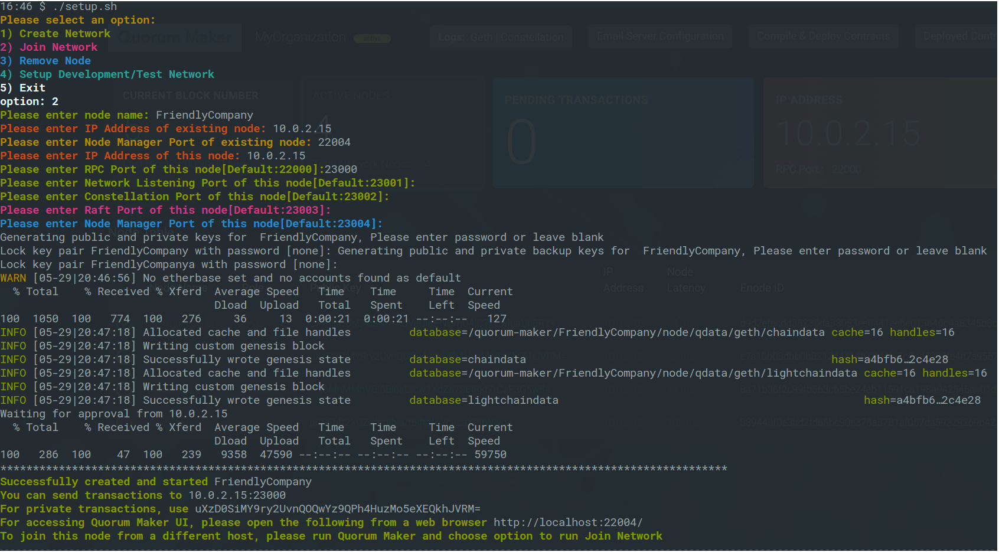 

At this point, a directory with the node name is created and most of the files are created. To join the existing network, the active node requires the Genesis file specific to the network. Quorum Maker will contact the node chose in the wizard and request permission to join and receive the Genesis file. An administrator of that node will get notifications on UI and e-mail for the join request and needs to approve it.

> Note: The joining node will wait 5 minutes for the approval. If the request is not approved within that time, the Quorum Maker will quit. But the administrator of the other node can approve the request any time. Once the request is approved, the node can be restarted by executing `./start.sh` from the directory created and the setup will be resumed. 

### Approve/Reject Join Request
-	Once a join request has been sent by a node willing to join a network to one of the existing network participants, this node has the option to approve/reject this join request
-	If the join request is accepted, the main node's constellation port, genesis file and network ID is returned to the joiner. If the join request is rejected, the joiner's setup script exits

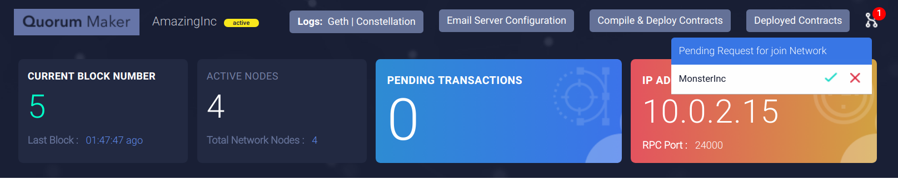 

## Attaching Quorum Maker to existing Quorum node

You can enjoy most of the features of Quorum Maker by attaching it to an existing Quorum Node. By having all existing nodes attached thruough Quorum Maker, it can eventually provide all features as native setup. 

> Note: Currently this is an expiremental feature and only Block and Transaction explorers are fully functional. 

Once the repository is successfully cloned, change to the Qorum Maker directory by `$ cd quorum-maker` and run `$ ./setup.sh` script.

After the required docker images are downloaded, Quorum Maker will present with few questions to complete the node setup. 

`Please select an option:`  
`1) Create Network`  
`2) Join Network`  
`3) Attach to an existing Node`  
`4) Setup Development/Test Network`  
`5) Exit`
`option:` 3
`Please enter node name:` MyRemoteNode
`Please enter the IP Address of Geth:` 35.231.238.41
`Please enter the Public Key of Constellation:` emupTbaUhpqUvezg4e4O2LywHer34qHAABNz+vAwWns=
`Please enter the RPC Port of Geth[Default:22000]:`
`Please enter the Network Listening Port of Geth[Default:22001]:`
`Please enter the Constellation Port[Default:22002]:`
`Please enter the Raft Port[Default:22003]:`
`Please enter the Node Manager Port of this node[Default:22004]:`

Except Node Manager port, all other details are of existing node. Please make sure to use an available port for Node Manager to avoid port conflicts. 

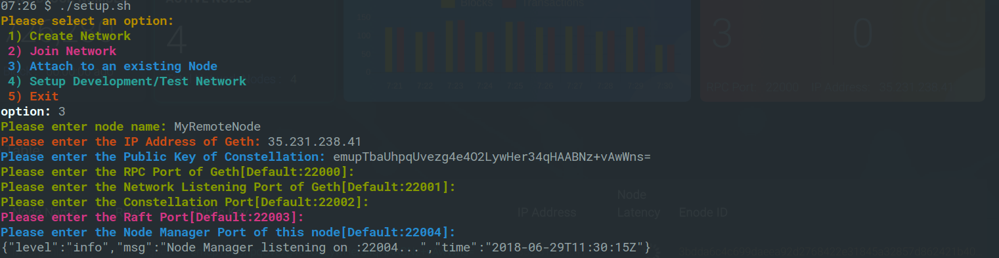 

## Quorum Maker Web UI

### Node Explorer
Quorum Maker provides a web interface to monitor the network. You can explore the blocks getting created and the transactions in them. Node admin can watch the performance of their node and other connected nodes to ensure availability and network resilience.

Administrators can view geth and constellation logs from Quorum Maker. 

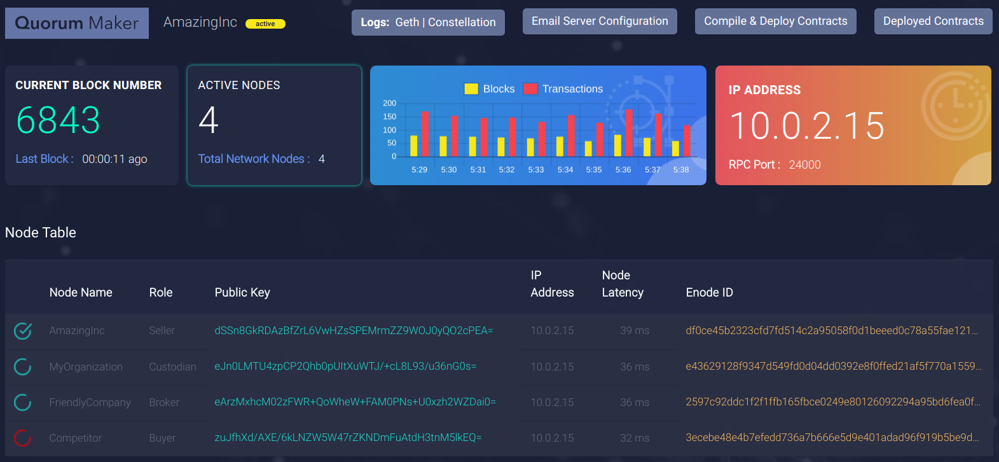 

Click on the node name of the table to view node details. You can also update the node name and role of your own node. Node name and Role are useful in a large network to identify the peers before sending transactions. Refer to the Quorum Maker API below to access node details using restful clients. 

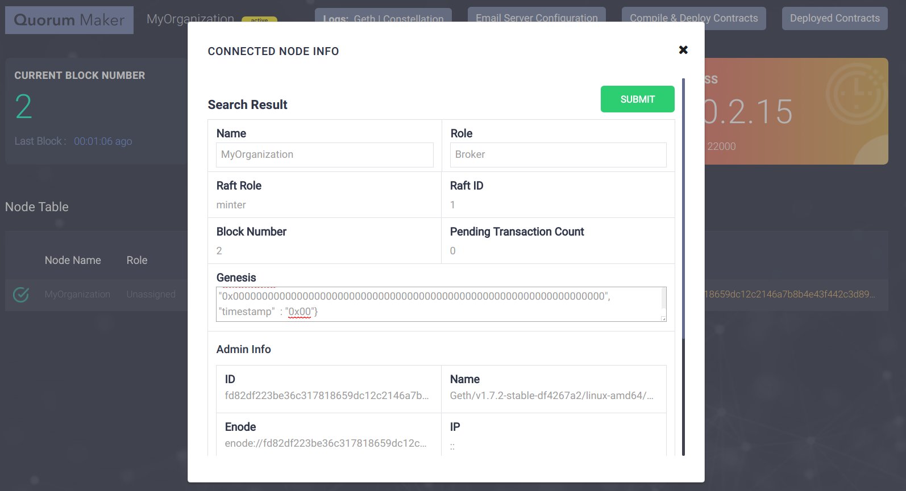 


### Blockchain Explorer

The Blockchain Explorer on Quorum Maker is customized for Quorum. You can click on the big block number button, and the blockchain explorer will be displayed. From here you can scroll through blocks, search by any content or expand to view more details. Transactions for the selected block is displayed on the right side and all the transactions belong to the block is highlighted in yellow. You can expand each transaction and view more details. Quorum has 3 types of transactions; public, private and Hash Only. Public transactions can be seen by every node on the network and is marked with a blue color <span style="color:blue">Public</span> label. Private transactions are avialable to your node to view and marked with a green color <span style="color:green">Private</span> label. Either you were a sender or recipient to these transactions. You can only the see the hash of the transctions to those you were not a party to. These are marked with a red color <span style="color:red">Hash Only</span> label. 

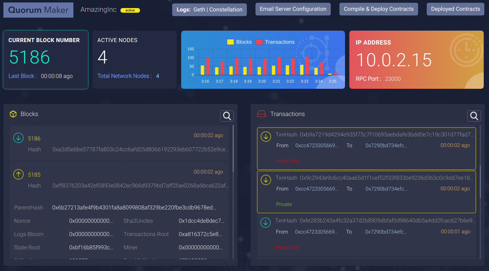 

### Transaction Parameters View

Quorum Maker can decode the sendTransaction parameters and displayed in human readable format. This is can aid both developers and node administrators get more visual details of the transactions in the network. 

 

To view the transaction parameters, select the transaction from the Transaction Explorer and scroll down to the end. Signature of the function and the decoded values in a table format will be displayed. You can mouse over to view any values truncated due to display real estate limitations. 

To decode the values, Quroum Maker requires ABI file of the Smart Contract. All contracts deployed thruough Quorum Maker has ABI available and the values will be decoded automatically. You can upload/attach the ABI file of the Smart Contract you deployed externally from the Smart Contract Explorer. 

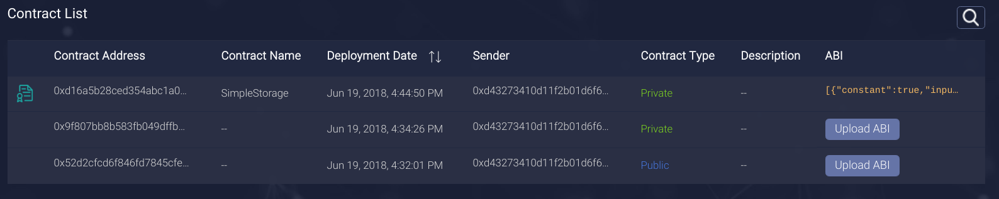 

> Note: Currently Quorum Maker supports ABI files generated by Truffle, solc compiler and solc Node.JS version. 

> Note: Only `uint256`, `bool`, `int256[n]` (Fixed Array), `bytes`, `uint32[]` (Dynamic Array) and `string` are supported currently. We are working to add support for all datatypes in a future release. 


### Contract Deployment

Smart contracts can be deployed from Quorum Maker. Users can choose solidity files (Even multiple contracts !) and deploy them publicly  or privately.  

1.	Multiple contracts can be uploaded via the Compile and Deploy Tab
2.	The source .sol files are compiled using solc and subsequently deployed 
3.	The deployment is done either publicly or privately
4.	In case of private deployment the public keys of the concerned parties are sent from the UI
5.	The list of network participants and their corresponding public keys are fetched using a REST API call 
6.	Error messages that occur from compilation failures are also displayed on the UI

All the deployed contracts are easily accessible from the UI in the format contractAddress_contractName and contain the corresponding ABI, Bytecode and JSON

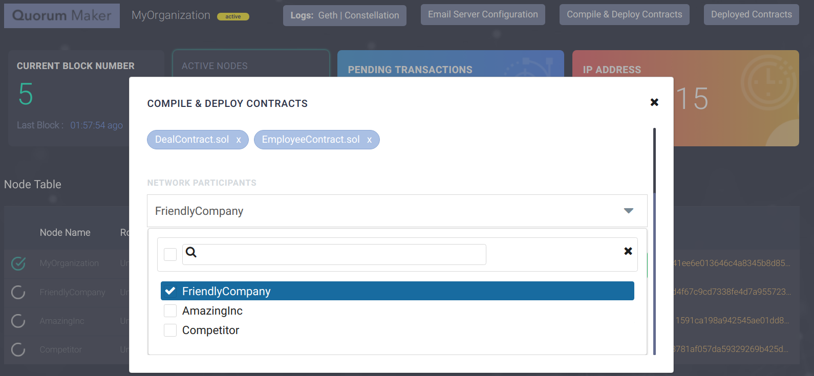 

### Contract Explorer

The Contract Explorer in Quorum Maker can view all the smart contracts deployed in the blockchain network. The Contract Explorer displays both public and private Smart Contracts. You can also view the details of them and attach ABI of those missing.

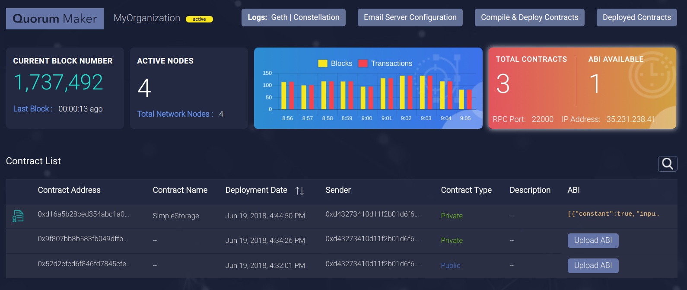 


The orange button on the top-right side of dashboard shows the total number contracts deployed on the blockchain. Click on this button to view the Contract Explorer. It also displays the ABI files available. All contracts deployed through Quorum Maker has ABI available already. If you are deploying through an external tool like Truffle, you can attach the ABI of the contract, so that transaction details of the contract can be viewed. 

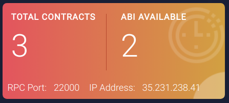 

Contract Explorer works hand-in-hand with Block and Transaction Explorer. Please read sections on Transaction Explorer for more details. 

### Log Viewer

You can view both Geth and Constellation logs from the Quorum Maker UI. In any event of failure, quick access to logs are important. Combined with E-Mail notification feature, administrators can even check the logs from a mobile device and spot errors. Quorum Maker also rotates the logs to keep the file size minimal.

 

### Monitoring and Email Notification
1.	There is an active monitoring system which checks whether the node is up every 30 seconds. If it fails to get the expected response which indicates that the node is functional, it waits for another 30 seconds and performs the health check again. If the check fails again then the user is notified
1.	The user is sent an email notification indicating that the node has gone down. The node admin must preconfigure the notification procedure by providing the following details on **Email Server Configuration** menu on UI:  
    - SMTP Sever Host
    - Port
    - Username
    - Password
    - Recipient E-Mail list (Comma separated)
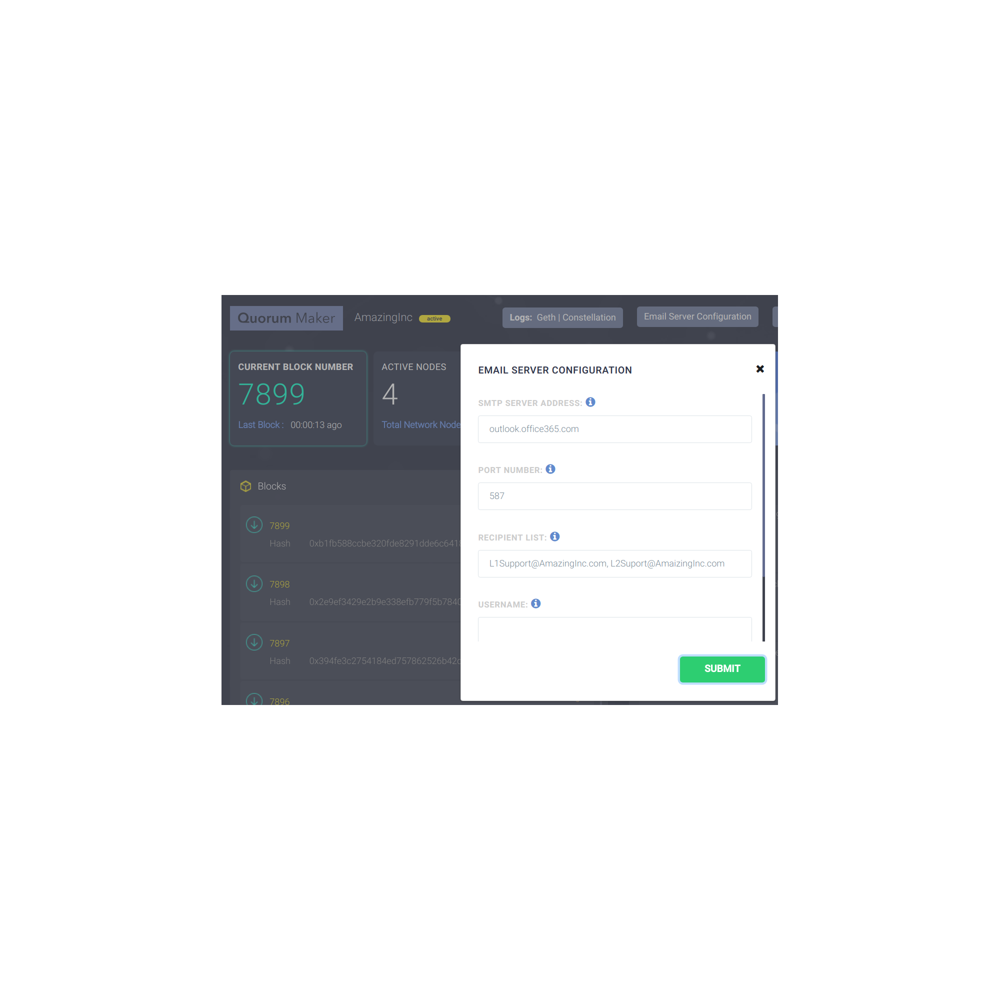 

1. Quorum Maker an also notify a request for join from another node. This lets node administrators not be online all the time to approve/reject a request.

1. If a new node is joined, Quorum Maker notifies this to all node administrators with both Joiner and Approver details. 


## Quorum Maker Node Manager API

Quorum Maker provides APIs that it used internally, that are also useful for application development. Below is a list and explanation of each:

|URI|Method|Description|
|--|--|--|
|/block|GET|This endpoint returns a list of latest n blocks if the query string parameter number is equal to n. If the query string parameter reference is provided with query string parameter number equal to n, then n blocks starting before (reference – 1) is returned|
|/block/{block_no}|GET|This endpoint returns the details of a particular block based on block number|
|/txn |GET |This endpoint returns a list of latest n transactions if the query string parameter number is equal to n|
|/txn/{txn_hash}|GET|This endpoint gets the transaction details of a transaction based on hash. If txn_hash is sent as "pending" it returns a list of all pending transactions|
|/txnsearch/{txn_hash}|GET|This endpoint returns details of a particular transaction based on transaction hash alongside its corresponding block details for displaying the corresponding block information of the queried transaction on UI|
|/latestBlock|GET|This endpoint the latest block number and the difference between present time and the time of creation of the block|
|/peer|GET|This endpoint returns a combination of admin.nodeInfo and certain other details such as current node name, node count, active status, IP, RPC port, raft role, raft ID, blocknumber, pending transaction count as well as the genesis file|
|/peer/{peer_id}|GET|This endpoint returns the information gleaned from admin.peers but filtered by enode-id of a particular peer for displaying the pop up from the node table|
|/nodeList|GET|This endpoint returns the node name, role, public key and enode of all participants in the network by querying the Network Manager contract|
|/pubkeys|GET|This endpoint returns a list of network participants and their corresponding public keys for populating the contract deployment tab's network participants list|
|/deployContract|POST|Multiple contracts can be uploaded via multipart file upload through this endpoint. The source .sol files are compiled using solc and subsequently deployed. The deployment is done either publicly or privately. In case of private deployment the public keys of the concerned parties are sent from UI. The list of network participants and their corresponding public keys are fetched using a REST API call. Error messages that occur from compilation failures are also displayed on UI. All the deployed contracts are easily accessible from the UI in the format|

## Using a different version of Geth/Constellation 
If you need to run Quorum Maker with a different version of Geth or Constellation than comes with default docker image, use [Quorum-Maker-Image](https://github.com/synechron-finlabs/quorum-maker-image "Quorum-Maker-Image"). Create docker image locally and run Quorum Maker again. 

## Windows/Mac Support

### Using Docker

Quorum Maker can be run on Windows/Mac using Docker. Some of features may not be available as running natively on Linux. Please refer to Docker doccumentation for missing features on Windows/Mac.

1. Install Docker for Windows/Mac
1. Install a git client for Windows/Mac (GitBash is recommended on Windows)
1. Git Clone or download Quorum Maker 
1. Run `$ ./setup.sh` and follow the instructions to setup Quorum Network as explained before in this document.

> Note: Since Docker can not expose bridge network to host on Mac, Quorum Maker automatically exports ports when creating Development/Test network on Mac. 

> Note: If you create a Development/Test Network on Mac, the ports are automatically exported in sequential number, starting 20104, 20204 and so on for each you node created. 

### Using Vagrant

For full support for running on Windows/Mac, Quorum Maker provides Vagrant box. 

1. Install Oracle VirtualBox for Windows/Mac
2. Install Vagrant for Windows/Mac
3. Install a git client for Windows/Mac (GitBash is recommended on Windows)
4. Git Clone or download Quorum Maker 
5. Run `$ vagrant up` to provision a vagrant box with support for Ubuntu 16.04, Docker and Docker Compose.
6. Run `$ vagrant ssh` to remote into vagrant box with default user `vagrant`
7. Quorum Maker is automatically copied to `/home/vagrant`. Run `$ ./setup.sh` and follow the instructions to setup Quorum Network as explained before in this document.

> Note: Vagrant box for Quorum Maker by default runs on 192.168.33.11. You can access Quorum Maker UI from Windows/Mac on a browser pointing to http://192.168.33.11:20104, http://192.168.33.11:20204 etc. (Quorum Maker automatically detects you are running from Vagrant and uses a different port than you entered to avoid conflicts. Read below) 

> Note: If you create a Development/Test Network, the ports are automatically exported in sequential number, starting 20104, 20204 and so on for each you node created. 

## Mobile Device Support

Quorum Maker provides a responsive Web UI that can be viewed from smaller Mobile devices as well. We belive that having been able to monitor the network, view transactions and logs, approve/reject request will be a tremendous help for network administrators. Clubbed these with E-Mail notification feature of Quorum Maker, Suport team can be available 24x7. 

  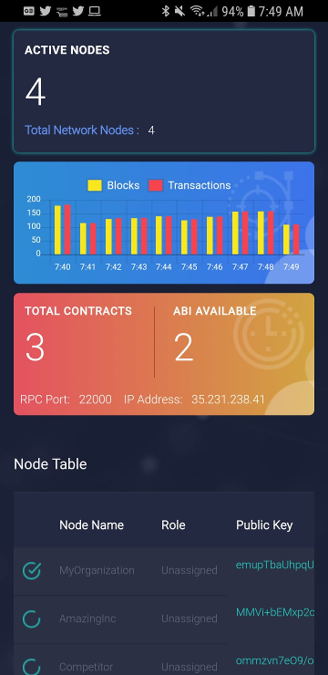 

> Note: Quorum Maker assumes user authentication and autherization will be handled by exisisting organizational security tools. A future release will support SSL and HTTPS. 

> Tip: Developers can expose Web UI running on their laptop using services like **ngrok** (https://ngrok.com/) for experimental purposes.

### Work In Progress

We expect the following areas to be part of future upgrades:

 - Support for Istanbul PBFT
 - HTTPS support
 - Password for private keys
## Known Issues
 ~~* Invalid Genesis  
 This happens while creating the nodes and this seems to be random issue. Please quit `./setup.sh` and try again~~ FIXED

## FAQ

